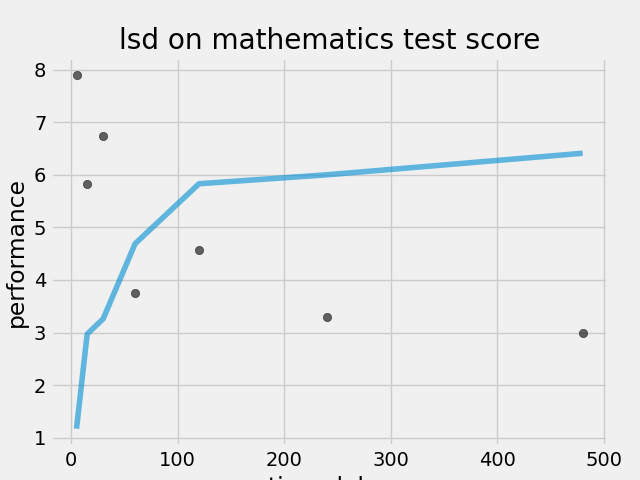
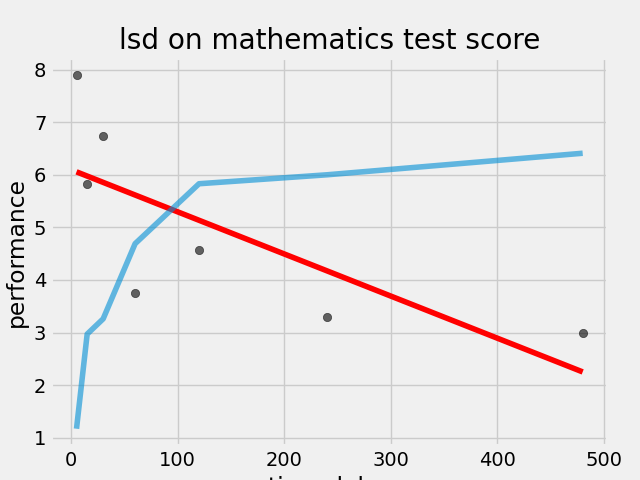

# Drug Effect on Mathematics Test Score
This is a simple linear regression project that examines the relationship between math scores and LSD usage. The goal of this project is to determine if there is a correlation between the amount of LSD used and math scores.

## Inspiration
This project is trying to understand the result of the following article:

> ### Abstract
> Previously published plasma concentrations of LSD-25, observed following intravenous iniection of 2 mcg. per kilogram of LSD-25, 
> have been found to be explained by the two-compartment open model. Performance scores on arithmetic tests were shown to be highly 
> linearly correlated with the concentration in the “tissue” (outer) compartment. The estimated volume of the plasma (inner) compartment 
> was 16.3 per cent of body weight, which is approximately the value reported for extracellular water; the estimated volume of the tissue 
> compartment was 11.5 per cent of body weight. The estimated half-life for loss of LSD-25 from the plasma compartment, based on the model,
> was 103 minutes compared with a half-life of 180 minutes calculated directly from plasma concentrations.

## Getting Started
To get started with this project, you will need to clone this repository to your local machine.

## Prerequisites
Make sure you have the following software installed on your local machine:

* Python 3
* NumPy
* Pandas
* Scikit Learn

## Running the Model
You can run the model by running the `main.py` file. The file reads the data from file, and trains the model.

````
python main.py
````

## Results




## Contributing
If you would like to contribute to this project, feel free to submit a pull request.

## License
This project is licensed under the [MIT license](https://github.com/farukbeygo/drug_on_math_score/blob/main/LICENSE).
